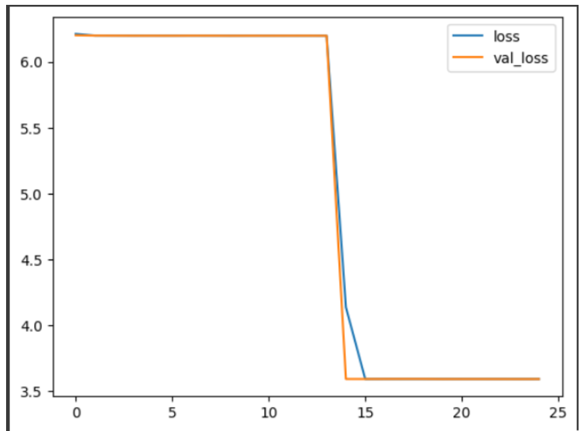
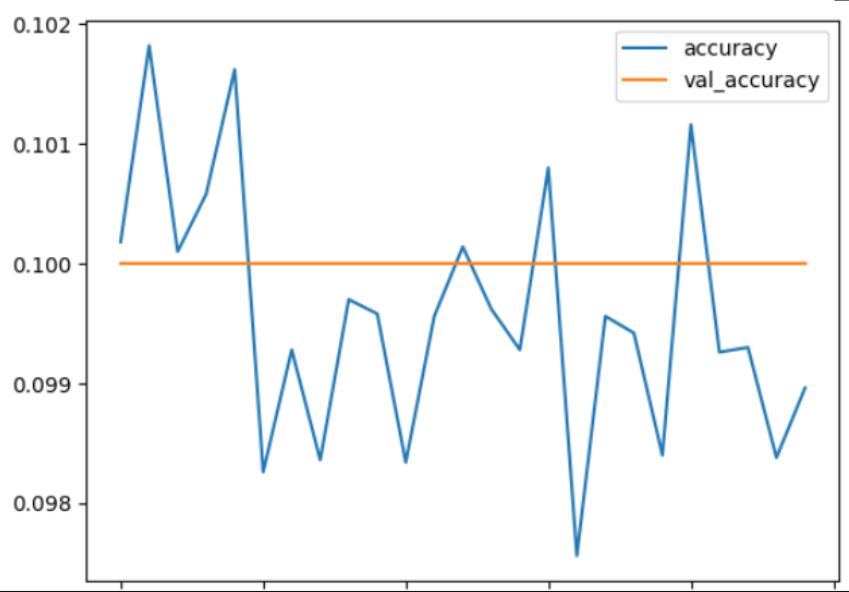

# <p align="center">Implementation-of-Transfer-Learning</p>
## Aim
To Implement Transfer Learning for CIFAR-10 dataset classification using VGG-19 architecture.
## Problem Statement and Dataset
The CIFAR-10 dataset consists of 60000 32x32 colour images in 10 classes, with 6000 images per class. There are 50000 training images and 10000 test images.

The dataset is divided into five training batches and one test batch, each with 10000 images. The test batch contains exactly 1000 randomly-selected images from each class. The training batches contain the remaining images in random order, but some training batches may contain more images from one class than another. Between them, the training batches contain exactly 5000 images from each class.

Here are the classes in the dataset, as well as 10 random images from each:


  
VGG19 is a variant of the VGG model which in short consists of 19 layers (16 convolution layers, 3 Fully connected layer, 5 MaxPool layers and 1 SoftMax layer).

Now we have use transfer learning with the help of VGG-19 architecture and use it to classify the CIFAR-10 Dataset

## DESIGN STEPS

### STEP 1:
Import tensorflow and preprocessing libraries

### STEP 2:
Load CIFAR-10 Dataset & use Image Data Generator to increse the size of dataset

### STEP 3:
Import the VGG-19 as base model & add Dense layers to it

### STEP 4:
Compile and fit the model

### Step 5:
Predict for custom inputs using this model

## PROGRAM
Developed By: **VIRGIL JOVITA.A**
</br>

Register No: **212221240062**
### Libraries
```py
import pandas as pd
import numpy as np
from sklearn.model_selection import train_test_split
from sklearn.metrics import classification_report,confusion_matrix

from keras import Sequential
from keras.layers import Flatten,Dense,BatchNormalization,Activation,Dropout
from tensorflow.keras import utils

from tensorflow.keras.preprocessing.image import ImageDataGenerator

from keras.datasets import cifar10
from tensorflow.keras.applications import VGG19
```
</br>

### Load Dataset & Increse the size of it
```py
(x_train,y_train),(x_test,y_test)=cifar10.load_data()

train_generator = ImageDataGenerator(rotation_range=2,
                                     horizontal_flip=True,
                                     rescale = 1.0/255.0,
                                     zoom_range = 0.1
                                     )

test_generator = ImageDataGenerator(rotation_range=2,
                                     horizontal_flip=True,
                                     rescale = 1.0/255.0,
                                     zoom_range = 0.1
                                     )
```
### One Hot Encoding Outputs
```py
y_train_onehot = utils.to_categorical(y_train,10)
y_test_onehot = utils.to_categorical(y_test,10)
```

### Import VGG-19 model & add dense layers
```py
base_model = VGG19(include_top=False, weights = "imagenet",
                   input_shape = (32,32,3))

model = Sequential()
model.add(base_model)
model.add(Flatten())
model.add(Dense(1024,activation=("relu")))
model.add(Dense(512,activation=("relu")))
model.add(Dense(256,activation=("relu")))
model.add(Dense(128,activation=("relu")))
model.add(Dense(10,activation=("relu")))
model.summary()
model.compile(loss="categorical_crossentropy",
              optimizer="adam",
              metrics="accuracy")

batch_size = 75
epoch = 25
train_image_generator  = train_generator.flow(x_train,y_train_onehot,
                                         batch_size = batch_size)		 
test_image_generator  = test_generator.flow(x_test,y_test_onehot,
                                         batch_size = batch_size)		 
model.fit(train_image_generator,epochs=epoch,
          validation_data = test_image_generator)
```
### Metrics
```py
metrics = pd.DataFrame(model.history.history)

metrics[['loss','val_loss']].plot()

metrics[['accuracy','val_accuracy']].plot()

x_test_predictions = np.argmax(model.predict(test_image_generator), axis=1)

print(confusion_matrix(y_test,x_test_predictions))

print(classification_report(y_test,x_test_predictions))
```
### Predict for own handwriting
```py

```


## OUTPUT
### Training Loss, Validation Loss Vs Iteration Plot

Training Loss, Validation Loss Vs Iteration             | Accuracy, Validation Accuracy Vs Iteration                   |               
:------------------------------------------------------:| :-----------------------------------------------------------:|
| | |

### Classification Report:





### Confusion Matrix:


## RESULT
Thus, transfer Learning for CIFAR-10 dataset classification using VGG-19 architecture is successfully implemented.
